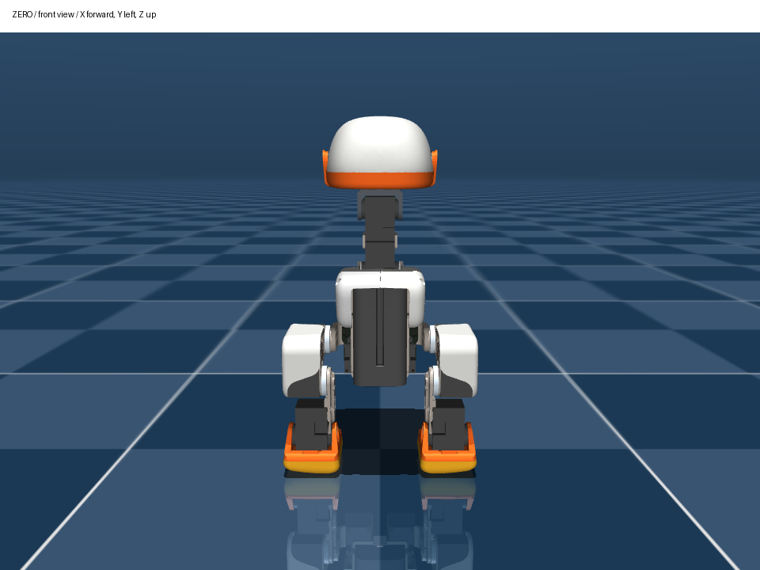
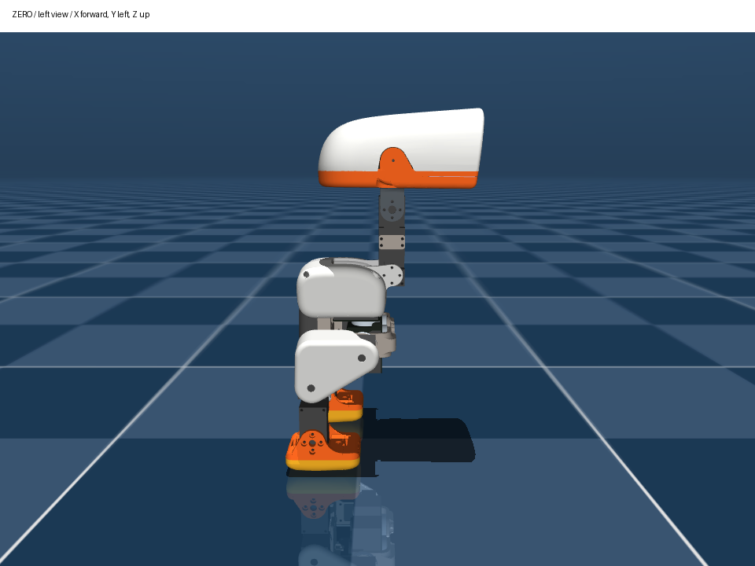
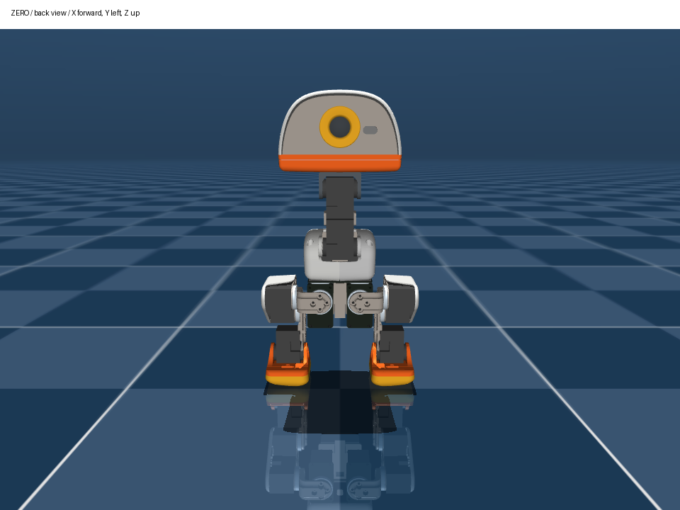
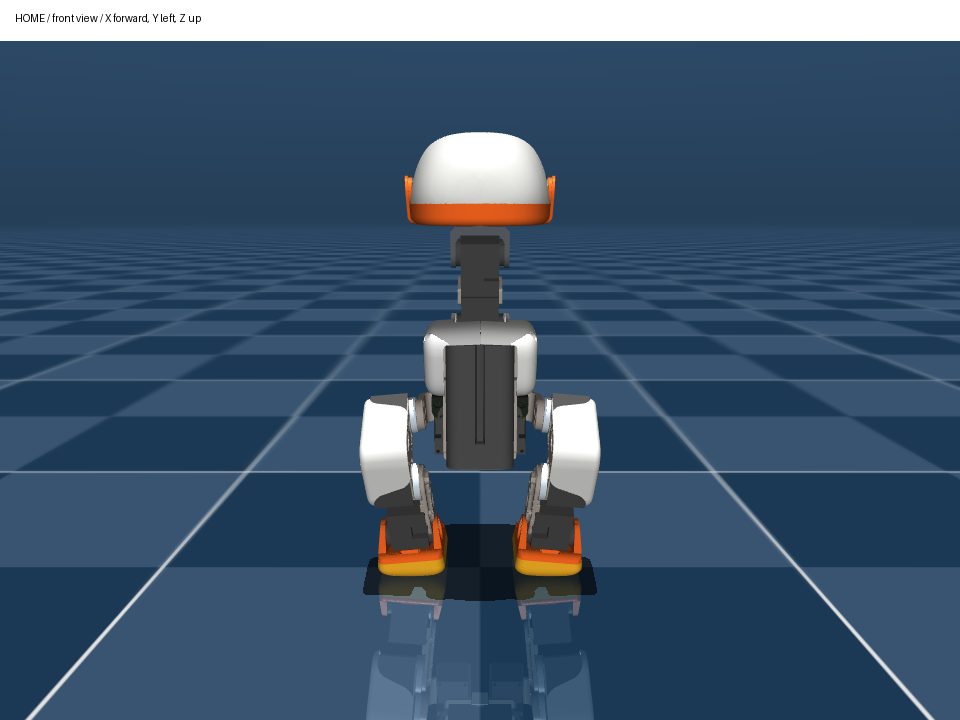
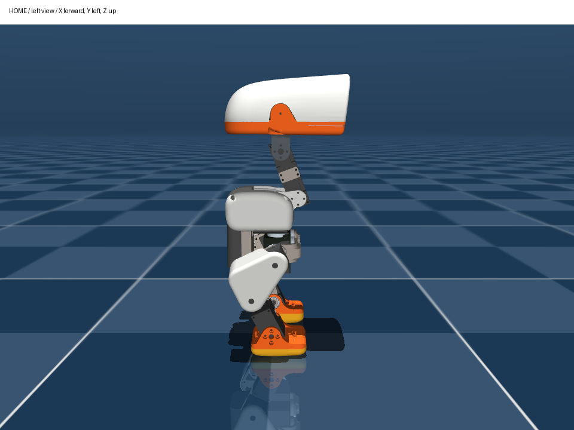
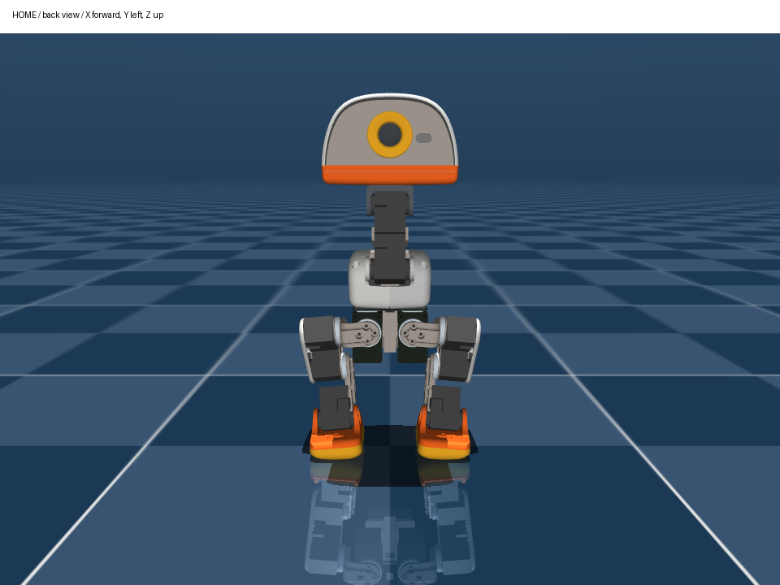

# 舵机零位、模型 ZERO 和训练 HOME

逐步操作、每个关节的正方向和标定后的只读检查，见 [零位标定操作步骤](零位标定操作步骤.md)。
需要先摆直腿参考、再让程序移到 HOME，见 [直腿标定到 HOME](直腿标定到HOME.md)。
`straight` 是独立的已知角度参考，不是本页的 ZERO 或 HOME。

## HD-1910 有零点吗？

有绝对位置编码器，也有内部位置偏移/校准功能。单圈配置下一圈分为 4096 个刻度，
通常使用 0–4095；每格约 0.0879°。2048 是这一刻度范围的中间位置，
**不能由此推断装好后的每个机器人关节都在模型零位。** 舵盘安装角、内部偏移及安装方向都影响对应关系。

本包采取软件标定：

```text
模型角 q = direction × (实际刻度 − zero_tick) × 2π / 4096
direction = +1 或 −1，由实测决定
```

不会调用飞特硬件中位校准。HD 的内部校准指令也不能简单照抄部分 STS 教程的“扭矩寄存器写 128”。
如果以后用其它工具改变内部偏移、转动舵盘安装位置或换舵机，本包的软件零位必须重新标定。

## 可以超过 4096 刻度吗？会自动转回零位吗？

要区分舵机能力和本部署包支持的范围。飞特 `HD-1910-C001` 规格书（2026-09-07，A/0）
第 3 页写明单圈 0–4095、中位 2048、每格 360°/4096；第 4 页 7-13 写明：
最高精度下支持正负 7 圈位置控制，**掉电不保存圈数**。所以 4095 是单圈表示的最大值，
不是硬件所有模式的位置上限。实际多圈功能还取决于固件和寄存器配置。

本包只处理分辨率 1、0–4095 的位置读数和目标，不启用多圈，也不对超界值取模。
模型运行时检测到过大的相邻位置跳变会退出并尝试卸力。
舵机自身能转多圈，也不意味着装好后的 Microduck 关节可以转多圈；连杆、外壳和电线都会限制转动范围。

- **单圈反馈**只表示这一圈内的角度。物理上转一整圈后读数可能回到相同值；这是角度表示循环，
  不是电机主动反向回零，也不能据此知道电线是否已经绕了一圈。
- **多圈反馈**在相应模式下可包含圈数。若圈数仍被正确记录，从多圈位置发回原位置可能跨过整圈；
  该规格书明确说断电不保存圈数，不能把它当成永久记录绕线次数的装置。
- **标定**给已知姿态建立刻度对应关系；本包的 `calibrate --pose zero` 不驱动舵机寻找这个姿态。
- **回 HOME**在标定完成、启动姿态接近 HOME 且检查通过后，才由程序发位置指令移动。
  HOME 与编码器 0、2048、模型全零姿态是不同概念。

未经本机模式和限位检查，不能保证向某个刻度发指令会走最短路径，或一定会退回先前转过的整圈。
不要在已组装的腿或颈部上用“旋转一圈找零位”做实验；应先卸力支撑，按模型几何标定。

## 默认位置怎么确定？

本次模型的默认位置来自训练任务的 `HOME_FRAME`，不是开机读数，也不是自动学出来的零点。
上游用它定义机器人的平衡起始姿态，策略观察 `当前关节角 − HOME`，动作按 `HOME + action` 解释。
因此部署必须保留同一组 HOME；更改 HOME 会同时影响观测和目标。

| 关节 | 你提供的 ID | HOME，rad | HOME，约 ° | 模型 ZERO 时正转轴 |
|---|---:|---:|---:|---|
| left_hip_yaw 左髋偏航 | 1 | 0 | 0 | −Z |
| left_hip_roll 左髋侧倾 | 2 | −0.0873 | −5.00 | +X |
| left_hip_pitch 左髋俯仰 | 3 | −0.4579 | −26.24 | +Y |
| left_knee 左膝 | 4 | −0.0049 | −0.28 | −Y |
| left_ankle 左踝 | 5 | +0.4530 | +25.95 | +Y |
| neck_pitch 颈俯仰 | 6 | +0.3491 | +20.00 | −Y |
| head_pitch 头俯仰 | 7 | +0.3491 | +20.00 | +Y |
| head_yaw 头偏航 | 8 | 0 | 0 | +Z |
| head_roll 头侧倾 | 9 | 0 | 0 | −X |
| right_hip_yaw 右髋偏航 | 10 | 0 | 0 | −Z |
| right_hip_roll 右髋侧倾 | 11 | +0.0873 | +5.00 | +X |
| right_hip_pitch 右髋俯仰 | 12 | +0.4579 | +26.24 | −Y |
| right_knee 右膝 | 13 | +0.0049 | +0.28 | +Y |
| right_ankle 右踝 | 14 | −0.4530 | −25.95 | −Y |

左右是机器人自己的左右。躯干 X 向前、Y 向左、Z 向上。正转按右手定则：
右手拇指沿正转轴方向，四指弯曲的方向为 q 增大。上游关节转动后，下游轴方向也随之变化，
所以方向核对最好从 ZERO 附近逐颗进行。表中 ID 来自你的记录，不能据此确定方向。
先按 README 用 `map-ids --profile servo_ids.user.json` 导入编号，再逐颗实测正反方向。

## 实际训练模型的参考图

这些图片直接用本次训练使用的 `robot_walk.xml` 渲染，没有用示意图猜测姿态。
模型壳体仍是原版几何；你的打印件可能有外观差异。图片用于辨识，精确标定应使用机械基准、夹具或量角工具。
**关节 q=0 不表示所有可见连杆都排成直线；不要只凭“腿看起来直”确定零位。**

### ZERO：模型 14 个 q 都为 0，用作一种标定基准





在这个物理姿态下，`calibrate --pose zero` 将当前读数直接作为 `zero_tick`。

### HOME：本次训练的默认站姿





若准确摆成这个姿态，`calibrate --pose home` 按下面公式计算软件零位：

```text
zero_tick = HOME姿态实测刻度 − direction × HOME角 × 4096/(2π)
```

例如颈部 HOME 是 +0.3491 rad；即使在 HOME 时刻度恰为 2048，也不能把颈部的 `zero_tick`
直接填成 2048，否则观测会固定偏差约 20°。

## 每次运行之前需要手动摆吗？

首次必须标定 ID、正方向和零位；改变安装后也必须重做。
完成标定后每次不需要再寻找舵机内部零点，因为绝对编码器能读取当前位置。

但**这两份策略只训练了平地步行，没有训练从任意折叠/倒地姿态起身**。
启动前仍应托住机身，摆到接近 HOME；程序读回当前位置，再用约 3 秒平滑移动到准确 HOME。
若任一关节离 HOME 超过默认 0.6 rad（约 34°），程序拒绝上力，提示重新摆放。
0.2.0 增加了显式 `home --from-pose straight` 例外：需要匹配的直腿标定记录、当前位置在参考 ±5° 内，
并通过单圈/硬件限位检查，用至少 8 秒移到 HOME。普通 `home/run` 的 0.6 rad 限制保留。
目标 HOME 到位容差默认 0.15 rad（约 8.6°）；这只是初步到位检查，精确零位仍应比它好得多。

原始姿态和坐标来源：Pollen Robotics `microduck_rl`，固定版本
`cb70b792312d559a4da09064d92009079671815f` 的 `microduck_constants.py` 与 `robot_walk.xml`。
图像基于 Pollen Robotics 的 Microduck 3D 模型，沿用其 CC BY-NC-SA 声明；见 [NOTICE](../NOTICE.md)。
