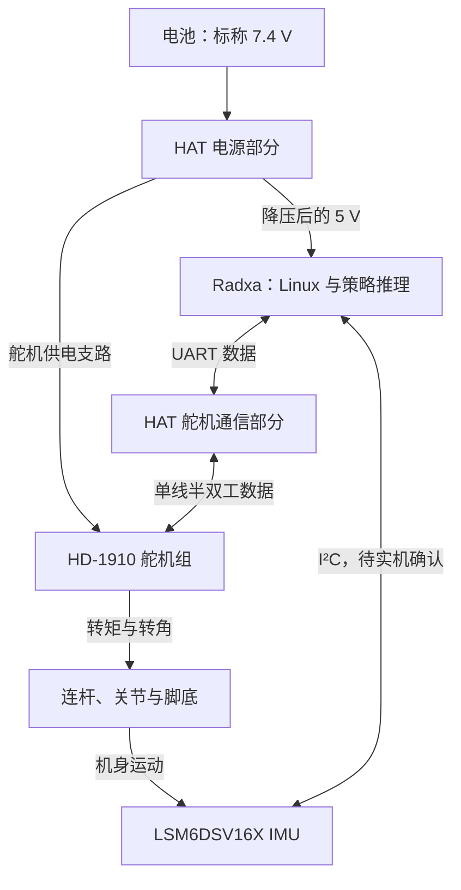
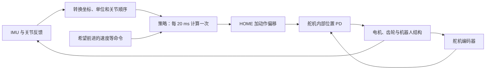

# Microduck 机械、电气与部署入门

适用对象：已组装、使用飞特 HD-1910、Radxa Zero 3W、HAT 扩展板、LSM6DSV16XTR 的 Microduck。
整理日期：2026-09-28。依据本地项目代码、厂家资料及用户已提供的信息；尚未检查这台真机。

## 先理解整台机器

机器人包含六个相互影响的部分：机械结构决定怎样运动，舵机提供运动和反馈，供电系统提供能量，
通信系统传递指令，传感器测量运动，控制软件根据测量决定下一步动作。

用户已确认：电池标称 7.4 V，接 HAT；HAT 降压输出 5 V 给 Radxa；IMU 直接接 Radxa，接口可能为 I²C。
HAT 的确切版本、线序、IMU 模块电路、实际总线和固件设置仍待核实。下图是功能关系，不能当作逐针接线图。



IMU 还需要适合模块的供电与 GND；图中省略了电源回路和其他外设。

## 1. 机械结构：什么在动，绕哪里动

### 1.1 组成与运动

| 名词 | 含义 | 在你的机器人上怎样理解 |
|---|---|---|
| 零件 | 单个制造出来的物体 | 打印件、螺钉、轴承、舵盘 |
| 组件／总成 | 多个零件装成的功能单元 | 一条腿、头部总成 |
| 刚体／连杆 Link | 建模时视作不变形、内部相对位置固定的部分 | 大腿、小腿、躯干；一个连杆可以由多个零件组成 |
| 关节 Joint | 两个连杆之间允许相对运动的连接 | 膝关节允许小腿相对大腿转动 |
| 旋转轴／轴心 | 关节绕着旋转的线及其截面中心 | 标定看旋转轴，不能随意用壳体边缘代替 |
| 自由度 DOF | 能独立变化的位置或角度数量 | 单个转动关节通常是一自由度 |
| 主动关节 | 有执行器施加控制力矩的关节 | 策略控制的 14 个关节 |
| 被动关节 | 没有独立控制输入、由接触或外力带动的运动 | 仿真中用于模拟齿隙的小角度被动关节 |
| 运动链 | 从机身到末端的关节和连杆序列 | 躯干→髋→大腿→膝→小腿→踝→脚 |
| 正运动学 FK | 已知关节角，计算各连杆和脚的位置 | 检查 ZERO 的膝、踝轴心关系 |
| 逆运动学 IK | 已知希望脚放在哪里，求关节角 | 可用于摆姿态；当前策略直接输出关节目标偏移 |

这份步行策略有 **14 个受控关节：左腿 5、右腿 5、头颈 4**。
每条腿为髋偏航、髋侧倾、髋俯仰、膝、踝；头颈为颈俯仰、头俯仰、头偏航、头侧倾。
整机参考设计还有嘴部舵机 ID 34，它不在当前步行策略的 14 个动作中。
仿真中的机身还可在空间平移和转动，这 6 个机身自由度也不等于多出 6 颗舵机。

### 1.2 支撑与安装

| 名词 | 含义与关系 |
|---|---|
| 舵机壳体 | 固定在上游结构上，承受电机反作用力 |
| 输出轴 | 舵机向外输出旋转和转矩的部位 |
| 舵盘／摇臂 | 把输出轴运动传给打印件的连接件；固定角度影响关节标定 |
| 花键／齿形配合 | 输出轴与舵盘靠齿形定位传力；齿数、直径和接口形状要匹配，不能只看舵机大小 |
| 从动支撑／同轴支撑 | 在关节另一侧帮助承载，绕同一根轴随动；不会因此多一个独立动作 |
| 轴承 | 支撑转轴并降低摩擦，承受相应方向的载荷 |
| 径向／轴向载荷 | 分别垂直于转轴、沿转轴作用的力；轴承型号和安装方法会影响承载能力 |
| 同轴度 | 两个支撑的轴线对齐程度；错位会使关节发紧、增大电流 |
| 公差／配合 | 实际尺寸允许偏差，以及孔与轴之间的松紧关系 |
| 干涉 | 零件在某个姿态互相碰撞，阻止继续运动 |
| 机械限位 | 结构实际上能运动到的边界 |
| 软件限位 | 程序允许的位置范围，应与实机机械范围核对 |
| 预紧／紧固 | 用适当夹紧力避免松动；不能把需要转动的结构一起夹死 |
| 线束余量／应力释放 | 给活动关节留适当线长并固定易受拉扯处，避免线成为额外限位或拔脱 |

HD-1910 的舵盘配合与 XL330 不同，复刻 CAD 修改了多处配合件。使用飞特版打印件解决的是机械安装；
是否保持原有轴间距、装配角和质量分布，还需核对。[复刻 CAD 说明](https://github.com/fanhao375/microduck-replica-cad)

### 1.3 运动能力与稳定性

| 名词 | 含义与实际影响 |
|---|---|
| 力 F | 推拉作用，单位 N |
| 转矩／力矩 τ | 让物体绕轴转动的作用，单位 N·m；垂直受力时 τ=F×力臂 |
| 力臂 | 转轴到力作用线的垂直距离；同样重量离关节越远，所需转矩越大 |
| kgf·cm | 舵机常见转矩单位；1 kgf·cm≈0.0981 N·m，不等于能在任意距离提起 1 kg |
| 转速／角速度 | 单位时间转过的角度，常用 rpm、°/s、rad/s |
| 减速比 | 电机转速与输出轴转速的比例；通常通过降低输出速度增加输出转矩，并引入损耗和间隙 |
| 堵转 | 目标仍要求运动，但轴被阻止转动；堵转转矩通常不能当作长期连续输出能力 |
| 摩擦 | 阻碍相对运动；小动作可能因静摩擦而不动，运动后摩擦又不同 |
| 齿隙／回差 Backlash | 换向时先消耗齿轮间隙，再把运动传给负载；与固定零点偏差不同 |
| 刚度／柔顺性 | 受力后抵抗变形／允许变形的程度；打印件、舵盘、齿轮和控制器都会影响它 |
| 阻尼 | 抑制速度变化和振荡的作用 |
| 质量 | 物体有多重，对加速所需的力有影响 |
| 质心 CoM／重心 | 质量的等效集中位置；本项目近地面可近似把两者视为同一点 |
| 转动惯量 | 质量相对转轴的分布决定转动有多难；质量相同，离轴更远通常惯量更大 |
| 支撑区域 | 脚与地面能提供支撑的区域；静止时重心投影与它的关系重要，行走还要考虑动态作用 |
| 接触摩擦／柔性鞋底 | 决定脚是否打滑、冲击怎样传递；更换鞋底材料也会改变仿真到实机的效果 |

例如把电池从躯干中心移到头顶，即使总重量没变，也会改变重心和惯量。
改腿长则同时改变力臂、脚的运动轨迹及所需关节力矩。

## 2. 角度、坐标、编码器、ZERO 与 HOME

### 2.1 三套容易混淆的量

| 名称 | 是什么 |
|---|---|
| 编码器刻度 | 舵机传回的数字；分辨率 1 的单圈表示为 0–4095，共 4096 个位置 |
| 模型关节角 q | 仿真和策略使用的角度；实际代码通常用 rad，180°=π rad |
| HOME | 训练中选定的默认站姿，是一组 14 个关节角 |

刻度 0 是编码器数值零点。模型 q=0 对应哪个刻度，取决于安装角、内部偏移和方向，需要标定。
2048 是单圈编码范围的中位；它不会自动代表机器人装配后的 HOME。

本程序换算为：

```text
模型角度 = direction × (当前刻度 − zero_tick) × 2π / 4096
direction 为 +1 或 −1，来自实际转动方向核对。
```

你选择的是直接记录 HOME：把 14 个关节同时摆到训练规定的 HOME 后，执行
`./run.sh calibrate --pose home`。程序保存 HOME 实测刻度，再反算内部使用的 `zero_tick`。
这一步不移动舵机，不把刻度清成 0，不要求先摆 ZERO。详见 [零位操作](../deploy_hd1910/docs/零位标定操作步骤.md)。

**分辨率**表示数字能分多细；**准确度**表示离真实角度多近；**重复性**表示多次回到同一目标有多一致。
12 位编码器有 4096 个数值，不等于机构实际定位误差小于一格；齿隙、安装和变形都会影响结果。

### 2.2 坐标与姿态

- 机体坐标：本模型 X 向前、Y 向左、Z 向上，左右均指机器人自己的左右。
- 世界坐标：地面上的固定参考；机器人转身后，机体前方与世界 X 不再相同。
- 传感器坐标：IMU 芯片自己的 X/Y/Z；安装后需转换成机体坐标。
- Roll 横滚／侧倾：绕前后轴转；Pitch 俯仰：绕左右轴转；Yaw 偏航：绕上下轴转。
- 正方向：角度增加所对应的实际运动；左右对称关节不一定使用同一符号。
- 旋转矩阵／四元数：计算机表示三维姿态的方法；它们不是新的实体传感器。

## 3. 主板、HAT、舵机与 IMU 分别负责什么

| 部件／名词 | 作用 |
|---|---|
| SBC 单板计算机 | 一块能运行操作系统的计算机；Radxa 属于这一类 |
| SoC 系统芯片 | 集成 CPU 和多种外设控制器的芯片；是主板上的核心器件 |
| CPU／RAM／存储 | 分别执行计算、保存运行中数据、长期保存系统和文件；RAM 与 eMMC/SD 容量不同 |
| MCU 微控制器 | 常用于执行确定性较强的底层控制；舵机内部有控制电路，某些 IMU 桥接方案另有 MCU |
| HAT／扩展板 | 为主板扩展电源、连接器和接口电路；名称本身不保证与任意 40 针主板兼容 |
| 舵机内部驱动器 | 根据控制指令给电机绕组供电；带编码器和控制器后形成位置闭环 |
| IMU 惯性测量单元 | 感知机身转动及加速度，给控制程序提供姿态估计依据 |

**HAT 上的“驱动”与舵机内部的“电机驱动”需要分清。** 原版 HAT 提供电源和舵机通信接口；
电机的具体调功率、位置闭环由 HD-1910 内部完成。它不需要 HAT 再给每颗电机独立输出一组电机相线。
原版 HAT 还包含音频和 BMI088；你使用的 LSM6DSV16X 是另一种芯片，不能套用 BMI088 驱动。
[原版 HAT 工程](https://github.com/pollen-robotics/elec_RPI_Robot_HAT)

你已说明 IMU 直接接 Radxa，因此不能照搬“IMU→STM32 小板→舵机总线”的软件读取路径。
换主控或传感器后，真正需要对齐的是接口、驱动、坐标、单位、更新率和延迟。

## 4. 电源：电从哪里来，电流怎么流

### 4.1 关键物理量

| 名词 | 含义与本机关系 |
|---|---|
| 电压 V | 两点间电势差；负载必须接在允许的电压范围内 |
| 电流 A | 流过导线的电荷流率；负载按工作状态取电，电源标注的容量不是强制灌入电流 |
| 功率 W | 能量消耗速率，直流近似 P=V×I |
| 电量 Ah／mAh | 电池可提供的电荷量；不能单独用它比较不同电压电池的能量 |
| 能量 Wh | 近似等于标称电压×Ah；续航还取决于实际平均功率和转换损耗 |
| 标称电压 | 给电池命名的典型电压；不是始终不变的稳压输出 |
| 2S／并联电芯 | 2S 指两节串联、提高电压；并联一般增加容量和可用电流，需按电池设计处理 |
| 峰值／持续电流 | 短时间能承受的电流与长期允许电流；舵机启动、换向、受阻会出现较大电流 |
| 压降 | 有电阻的电池、接头、线束中，电流增大时电压损失增大；近似 ΔV=I×R |
| 纹波／瞬态 | 电源电压上的周期波动／快速变化，会影响主板与传感器 |
| 欠压复位 Brownout | 供电跌落导致芯片复位，可能表现为主板重启或舵机失联 |

如果你的电池是每节满充 4.2 V 的常见 2S 锂电池，标称 7.4 V 时满充约 8.4 V；实际应核对电池标签。
飞特这份 HD-1910 规格书给出的工作范围为 4–8.4 V，仍需匹配实际型号与供电瞬态。
HAT 能接受某个输入电压，不代表连在舵机接口上的电机也能承受这个电压。
[HD-1910 厂家规格书](../microduck-replica/tools/FeeTech_HD1910M_Servo/HD-1910-C001串型规格书20260907.pdf)

### 4.2 电源器件与回路

| 名词 | 作用 |
|---|---|
| DC-DC／Buck 降压 | 用开关电路把较高直流电压转换成较低电压，如电池降到主板所需 5 V |
| LDO 线性稳压器 | 另一种稳压方式；压差部分主要变成热，常用于较小功率支路 |
| GND／地 | 电路的参考节点和电流回路的一部分；机器人里的 GND 不必连接大地 |
| 共地 | 非隔离通信两端共享参考电位；电源与数据需要完整、合理的回流路径 |
| 地弹／共阻抗耦合 | 大电流经过共用地线产生电压变化，使传感器参考电位也跟着波动 |
| 去耦／储能电容 | 为芯片附近的快速电流变化提供缓冲；不是给不够大的电源无限补能 |
| 保险丝／PPTC | 对相应过流情形提供保护；需要看额定参数和动作特性 |
| TVS／反接保护 | 分别限制一定范围的电压瞬态、处理电源极性接反风险；是否具备要看实际电路 |
| BMS／电池保护板 | 可提供电芯保护、均衡等功能，具体取决于设计 |
| 充电器 | 按电池化学体系与串数执行充电过程；降压板或保护板不自动等于充电器 |

原版 HAT 的舵机电源接到 `+BATT`，5 V 降压是另一支路。两颗舵机用线“一个接一个”连接时，
通常是电源和地分别连通，**每颗舵机并联在同一电源上**。它们不会把 7.4 V 平分。
靠近电源的那段线与接头可能承受后面多颗舵机的总电流。
[官方 HAT 原理图，第 3、4 页](../elec_RPI_Robot_HAT/production/ASE01187-C1_elec_RPI_Robot_HAT_SCH.pdf)

电源选型要看整个路径：电池→开关→连接器→线束→PCB 铜箔→舵机，而不只看某颗芯片额定值。
并联总电流可近似相加，但降压前后的电流要按功率与效率换算，不能把 5 V 支路的安培数直接加成电池侧安培数。
舵机大电流不应让细信号跳线或 GPIO 电源脚代为承载。

### 4.3 供电电压与信号电平

**7.4 V 电池、5 V 主板供电、3.3 V 逻辑是不同用途。**

Radxa ZERO 3 的 GPIO 使用 3.3 V 电平；主板接 5 V 电源并不表示 GPIO 可以接 5 V。
40 针中包含电源、地和可复用信号脚，并非全部都是普通 GPIO。
[Radxa 官方接口说明](https://docs.radxa.com/en/zero/zero3/hardware-design/hardware-interface)

LSM6DSV16X 裸芯片 VDD 为 1.71–3.6 V，VDD_IO 为 1.08–3.6 V。
购买的小模块是否能接 5 V，要看它有没有稳压和电平转换；不能从芯片名称推断。
不要把舵机电池线接入 IMU 或 GPIO。[ST 数据手册](https://www.st.com/resource/en/datasheet/lsm6dsv16x.pdf)

## 5. 电路板文件：怎样看懂一块板

| 名词／文件 | 含义 |
|---|---|
| 原理图 Schematic | 表示元件电气关系；画得远也可能因相同网络标签而实际连接 |
| 网络 Net／网络名 | 电气上连接的节点集合，如 `GND`、`+BATT`、`SDA` |
| 位号 | 某一个元件的位置身份，例如 R12、C7、U3、J2；不是产品型号 |
| R／C／L | 电阻、电容、电感；分别常用于限流/分压、储能/滤波、开关电源与滤波等 |
| D／Q／U／J | 常用于二极管、晶体管、集成电路、连接器的位号前缀 |
| PCB | 制造好的印刷电路板，靠铜箔与过孔连接焊盘 |
| PCBA | PCB 上已完成元件装配的板子 |
| 封装 Footprint | 元件在 PCB 上的焊盘尺寸、排列和机械占位 |
| 焊盘／过孔／铺铜 | 分别用于焊接连接、跨板层连接、形成较大面积的导电区域 |
| 板层／走线宽度 | 影响布线、回流、发热和载流能力；大电流线路不能只按外观判断承载 |
| 丝印 | 板面的文字与标志，帮助识别元件和方向；最终电气关系以设计和实测为准 |
| BOM | 物料清单，列出型号、数量、位号等；不同版本的 BOM 要与 PCB 匹配 |
| Gerber | PCB 厂生产铜层、阻焊、板框等所需的图形文件；钻孔通常有单独文件 |
| CPL／POS／贴片坐标 | 贴片机使用的元件位置、角度和板面信息 |
| SMT／DIP | 常指表面贴装和通孔装配工艺类别 |
| DNP／不贴 | 设计预留但该配置不装的元件；它不一定是漏焊 |
| KiCad／Altium | 电路设计软件；`.kicad_sch`、`.kicad_pcb`、`.SchDoc`、`.PcbDoc` 是对应设计文件 |

替换电路元件要同时核对功能、引脚定义、封装、耐压、电流、时序、外围电路和热条件。
同封装、同电压或名称相近，都不足以独立证明兼容。

读原理图的顺序可以是：电池输入→电源转换与保护→主控接口→舵机收发电路→IMU→其他外设。
先找到 `GND` 和各电源网络，再追信号网络，比从每颗小电阻开始更容易。

## 6. 通信：插头、电平、总线、协议和设备号

需要从外到内核对五层：**连接器形状→每针定义→电压电平→通信方式→数据协议**。
能插上只能说明部分机械尺寸匹配。

| 名词 | 含义与本机关系 |
|---|---|
| Pin／物理针脚 | 插座上的具体位置编号；要按板的正反面、Pin 1 标记确认 |
| GPIO | 可配置数字输入输出；同一物理脚可复用为 UART、I²C 等功能 |
| Pinmux／引脚复用 | 软件选择该脚当前执行哪一种硬件功能 |
| 逻辑高低电平 | 用电压范围表示 1 和 0；阈值、耐压取决于芯片 |
| 电平转换 | 在不同信号电压之间转换，不能用普通导线代替 |
| 总线 Bus | 多个设备共享的一组通信线路 |
| UART | 异步串行通信，常见 TX 发送、RX 接收 |
| Baud／波特率 | UART 的符号速率；常见二进制 UART 下 1 Mbps 是约每秒 100 万位，不是每秒 100 万条关节命令 |
| 半双工 | 同一数据通道收发轮流进行；需要适当的收发切换电路和时序 |
| TTL 舵机总线 | 常见单端单线数据接口；“TTL”并不能单独确定每一端的电平与耐压 |
| RS-485 | 差分通信物理层，需要收发器；不能把 A/B 线直接接 TTL 数据脚 |
| 协议 Protocol | 规定报文、命令、地址、数据类型和校验规则 |
| 校验和／CRC | 检查报文是否在传输中损坏；并不证明命令对机器人有正确含义 |
| 舵机 ID | 同一舵机总线上区分设备的地址；不是机械关节名字，通常必须唯一 |
| 寄存器 | 设备中有地址的数据项，如当前位置、目标位置、模式、温度；需按该型号解释 |
| RAM／EEPROM | 易失与非易失设置存储；是否掉电保留要看寄存器说明 |
| 同步读写 | 用总线协议批量访问多颗舵机，减少开销；不是给每颗舵机拉独立控制线 |
| I²C | 常用 SDA 数据、SCL 时钟，让同总线多个芯片按地址通信 |
| 上拉电阻 | I²C 的开漏信号靠它回到高电平；上拉到哪一电压也决定信号电平 |
| I²C 地址 | 芯片在这一条 I²C 总线上的地址；本 IMU 可为 0x6A 或 0x6B，需核对配置 |
| SPI | 常用 SCLK、MOSI、MISO、CS；通过片选区分设备，通常比 I²C 多用线 |
| Linux 设备节点 | 软件访问硬件的入口，如 `/dev/i2c-N`、`/dev/ttySx`；编号不等于物理脚编号 |

飞特与 Dynamixel 即使使用相似的串行硬件接口，报文和寄存器解释也不能直接混用。
HAT 的接口转换不会自动把 Dynamixel 指令翻译成飞特指令；软件仍须实现飞特协议。

已有资料里，HD-1910 三针接口的 Signal/GND 针号表述出现冲突，且观察插头的方向会影响左右。
因此本文不提供猜测的逐针接法。应核对这颗舵机的厂家端口图、HAT 电路、实际线材端到端关系；
通断检查在断电状态下进行，不以线色代替核对。

Radxa 的物理针号、GPIO 名、复用功能与 Linux 总线号是四个不同概念。
安装系统的设备树配置还可能改变启用的功能。详见 [Radxa 与 IMU 接线说明](../deploy_hd1910/docs/Radxa与IMU接线.md)。

## 7. IMU：它能测量什么

| 名词 | 含义 |
|---|---|
| 六轴 IMU | 三轴加速度计＋三轴陀螺仪；这里的“轴”是测量通道，不是六个机器人关节 |
| 加速度计 | 测量比力，静止时可用于推算重力方向；运动中还包含加速作用 |
| 陀螺仪 | 测量角速度；不是直接输出绝对朝向 |
| 量程 | 能测的最大范围；越大不代表在小动作上越精细 |
| ODR／采样率 | 传感器每秒产生数据的次数 |
| Bias／零偏 | 静止时仍残留的系统偏移，可校准；与舵机机械零位不同 |
| 噪声／漂移 | 随机波动／估计误差随时间积累 |
| 坐标映射 | 把传感器坐标转换为躯干坐标；放置方向换了，映射就可能变化 |
| 姿态融合 | 结合陀螺仪与加速度等信息估计姿态 |
| 投影重力 | 在机体坐标中表示重力方向；本程序直立时约为 `[0,0,-1]`，这是软件约定，不是所有原始加速度读数的符号 |
| FIFO／时间戳 | 缓存样本／标识采样时间，帮助处理数据新鲜度和时序 |

LSM6DSV16XTR 中 `TR` 对应包装方式；不表示多了一个传感轴。
芯片支持内部融合，但当前部署程序采用哪条数据路径，要看驱动实现，不能默认所有硬件功能都已使用。
[ST 数据手册](https://www.st.com/resource/en/datasheet/lsm6dsv16x.pdf)

IMU 应刚性固定在躯干。若装在活动头部，它测得的是头部运动，不能仅用一个固定坐标变换就当作躯干测量。
只检查静止时读数正常还不够，需要分别检查前后倾、左右倾和转身。
六轴 IMU 单独不能长期提供无漂移的绝对航向，也不能直接给出可靠的地面前进速度。

## 8. 舵机与强化学习：两个控制闭环

### 8.1 舵机的五种模式

HD-1910 规格书列出：0 角度伺服并可限力；1 恒速；2 恒流；3 PWM 开环调速；4 纯位置 PD。
当前部署要求模式 4。单圈／多圈是另外的位置范围设置，不应当成模式编号 5。
[HD-1910 厂家规格书，第 4 页](../microduck-replica/tools/FeeTech_HD1910M_Servo/HD-1910-C001串型规格书20260907.pdf)

| 名词 | 含义 |
|---|---|
| 目标位置／反馈位置 | 希望关节到哪里／测得它当前在哪里 |
| 位置误差 | 目标减反馈，控制器据此产生动作 |
| 闭环／开环 | 是否利用反馈修正输出 |
| P 比例项 | 根据位置误差产生控制作用；增大 P 会改变响应，但过大可能振荡 |
| D 微分项 | 根据变化速度产生作用，常用于抑制振荡 |
| I 积分项 | 累积误差以补偿持续偏差；这份部署使用纯 PD 模式 |
| PWM | 通过开关占空比调节驱动；内部电机 PWM 与传统航模舵机的脉宽指令不是同一接口 |
| Torque Enable | 舵机是否使能输出；卸力并不等于不存在齿轮摩擦，也不等于切断供电 |
| 增益 | 控制器中的响应系数；不同品牌数值尺度不同，P=5 与 P=200 不能直接按比值比较 |

整机存在两层闭环：



策略 50 Hz 指每 20 ms 更新一次目标，不等于 UART 波特率，也不等于舵机内部 PWM 频率。
头部、腿部各项输入输出必须按训练时顺序排列；数据长度正确不代表意义正确。

### 8.2 仿真和部署名词

| 名词 | 含义与本项目位置 |
|---|---|
| CAD | 机械设计，描述零件、装配、尺寸与配合 |
| STL／STEP／3MF | 分别常用于三角网格、几何交换、打印项目；不能把网格外形直接当作完整动力学模型 |
| URDF／MJCF | 机器人描述格式，包含连杆、关节、质量、惯量、碰撞等；本项目训练主要用 MJCF |
| 可视网格／碰撞几何 | 渲染外形／物理引擎用于接触计算的形状；看见外壳不保证仿真真的检查了外壳碰撞 |
| MuJoCo／mjlab | 物理仿真引擎／构建训练任务的框架 |
| 执行器模型／BAM | 描述电压、速度、摩擦、惯量与输出转矩之间关系 |
| 参数辨识 | 用实测输入输出估计电机或机构参数 |
| 观测 Observation | 策略看到的数据，本模型为 61 维 |
| 动作 Action | 策略输出，本模型为 14 个关节目标角偏移 |
| 策略 Policy | 从观测计算动作的函数，通常是神经网络 |
| 奖励 Reward | 训练时评价行为的指标，例如跟踪速度、减少不必要动作 |
| PPO | 本项目使用的强化学习训练算法 |
| 随机化 | 训练中改变摩擦、质量、噪声、延迟等，提高对一定范围差异的适应性 |
| Checkpoint／ONNX | 训练检查点／部署推理用模型格式；ONNX 不是舵机固件，也不包含全部硬件驱动 |
| 训练／推理 | 学习网络参数／用已训练网络算动作；Radxa 在当前方案中负责推理 |
| Sim2Real | 将仿真学到的控制迁移到真机，需要对齐机械、电气、软件和时序 |
| 延迟／抖动 | 信息或动作晚到的时间／这个时间的波动；算得快不代表端到端反馈及时 |

当前 HD 两版主要替换了执行器动力学和供电参数；**刚体几何、质量、质心与惯量仍沿用原模型**，
电机等效惯量则随执行器参数改变。飞特版打印件的修改不自动进入训练模型。
齿隙版采用每个关节 ±1° 的假设，尚未测量本机真实间隙。
[本次训练参数对照](HD1910与原版训练参数对照.md)

随机化不能修复错误线序、错误 ID、反向关节或错误的 IMU 坐标。
如果只改变通信设备名但物理动作保持一致，通常先改部署配置；如果腿长、转轴、质量分布或动力学明显变化，
需要更新模型、重新验证，必要时重新训练。是否重训应由实际差异和验证结果决定。

## 9. Linux 和项目文件：各自在什么位置

| 名词 | 在本机上的用途 |
|---|---|
| 系统镜像 | 写入 SD/eMMC 的操作系统及相关配置；必须适合实际主板 |
| 内核／驱动 | 管理硬件、提供设备访问接口 |
| 设备树／Overlay | 告诉内核板上有什么硬件、哪些引脚采用哪种功能 |
| 固件 | 在舵机或 MCU 内部运行的软件，与主板 Linux 应用不同 |
| 串口控制台 | 系统调试日志和交互接口，可能占用你想用于舵机的 UART |
| ARM64／x86_64 | CPU 架构；训练电脑能安装的软件包，不一定能原样在 Radxa 运行 |
| 虚拟环境 venv | 隔离 Python 依赖；不是机器人仿真环境 |
| SSH／SCP | 远程登录／复制文件；网络连通不代表舵机总线已连通 |
| robot.json | 这台机器的 ID、方向、零位、IMU 等配置，需要匹配实际硬件 |
| 日志／看门狗 | 记录运行过程／检测一定范围的超时故障；软件看门狗也依赖系统和通信仍能工作 |

项目之间的关系：

| 目录 | 主要用途 |
|---|---|
| `microduck-replica-cad` | 国产复刻机械设计与装配资料 |
| `microduck-replica` | 复刻整机、电控、工具和适配说明 |
| `elec_RPI_Robot_HAT` | 原版 HAT 原理图、PCB 和生产文件 |
| `microduck` | 官方机器人运行软件 |
| `microduck_rl`／`microduck_rl_hd1910` | 原版／本地 HD 版训练与仿真 |
| `xgoduck_hardware` | Uno Q、另一款 IMU 和扩展板组成的衍生方案，不能直接视作本机接线资料 |
| `deploy_hd1910` | 为你整理的独立部署目录，含模型、驱动、标定和诊断命令 |

## 10. 怎样判断一个国产替换件是否适用

| 层面 | 要对齐什么 | 常见后果 |
|---|---|---|
| 机械 | 外形、安装孔、舵盘、轴线、行程、质量分布 | 装不上、卡住、重心变化 |
| 电源 | 工作电压、峰值电流、连接器与线束载流 | 压降、复位、过热 |
| 信号 | 针序、逻辑电平、收发方式 | 不通信或损坏接口 |
| 协议 | 地址、报文、寄存器、单位、工作模式 | 能读到数但控制意义错误 |
| 时序 | 更新率、延迟、总线带宽、抖动 | 动作慢、振荡、反馈过期 |
| 控制模型 | 转矩速度关系、摩擦、齿隙、增益、几何 | 仿真能走，实机效果不同 |

“能装上”“能通电”“能通信”“能正确走路”是不同的验证结果。
每次只确认其中一项，不能据此跳过另外几项。

### 常见现象与优先检查方向

| 现象 | 先检查什么；这些不是已经确定的诊断 |
|---|---|
| 一上力主板就重启 | 电池、接头、5 V 支路、地线及舵机瞬态电流 |
| 单关节反向或一下转很远 | ID、direction、HOME 标定、单位、模式、是否跨单圈边界 |
| 关节发烫但不动 | 干涉、同轴度、紧固、限位和目标位置，随后再看增益与负载 |
| 主板能 SSH，但找不到舵机 | 舵机供电、线序、UART 是否启用/被占用、波特率、协议 |
| IMU 静止正常，倾斜后方向不对 | 安装位置、坐标映射、轴符号、单位和数据新鲜度 |
| 能站稳但走得慢 | 指令槽位、摩擦、目标与反馈、供电、限流、机械阻力及策略本身 |

对你当前阶段，先把五件事弄清楚最有用：

1. 每个关节的真实旋转轴、活动范围与舵机 ID。
2. 电池、舵机电源、5 V、3.3 V、GND 分别走到哪里。
3. HAT 接口类型、实际线序、Radxa UART 和 IMU 总线配置。
4. 全部关节的方向与 HOME 刻度，以及 IMU 的躯干坐标映射。
5. 真机的结构和动力学与训练模型有哪些已知差异。

这五项串起来后，标定和部署命令才有明确的物理含义。
